<p align="center">
  
</p>

<p align="center">
  <strong>An append-only, bitemporal ledger database with MVCC snapshot reads and a SQL query interface.</strong>
</p>

<p align="center">
  <a href="https://github.com/spectra-db/SpectraDB/actions"></a>
  <a href="LICENSE"></a>
  <a href="https://www.rust-lang.org"></a>
</p>

---

SpectraDB is a single-node embedded database that treats every write as an immutable fact. It separates the **system timeline** (when data was recorded) from the **business-valid timeline** (when data was true), giving you built-in time travel and auditability with zero application-level bookkeeping.

## Key Features

- **Immutable Fact Ledger** — Write-ahead log with CRC-framed records. Data is never overwritten; updates create new versions.
- **MVCC Snapshot Reads** — Query any past state with `AS OF <commit_ts>`.
- **Bitemporal Filtering** — Separate system and valid-time dimensions with `VALID AT <valid_ts>`.
- **LSM Storage Engine** — Memtable, SSTable with bloom filters, block index, and mmap reads. Background compaction keeps read amplification low.
- **SQL Interface** — `CREATE TABLE`, `INSERT`, `SELECT`, `JOIN`, `GROUP BY`, views, indexes, transactions, `EXPLAIN`, and more.
- **Interactive Shell** — TAB completion, persistent history, table/line/JSON output modes.
- **Optional Native Acceleration** — C++ kernels behind `--features native` via `cxx`, with pure Rust as the default.

## Use Cases

### Audit Logging & Compliance
Every mutation is an immutable, timestamped fact. Reconstruct the exact state of any record at any point in time — ideal for financial systems, healthcare records, and regulatory compliance where you need a provable history of changes.

```sql
-- What did this account look like at the end of Q4?
SELECT doc FROM accounts WHERE pk='acct-001' AS OF 1735689600;
```

### Event Sourcing
Use SpectraDB as the append-only event store backing your event-sourced architecture. The bitemporal model naturally captures both when events happened in the real world and when the system learned about them.

```sql
-- Replay all order events as the system knew them at deployment time
SELECT doc FROM orders AS OF 1700000000;
```

### Temporal Data Management
Model entities with business-valid time ranges — employee contracts, insurance policies, price schedules — and query them naturally without maintaining complex versioning logic in your application.

```sql
-- What policy was active for this customer on March 15?
SELECT doc FROM policies WHERE pk='customer-42' VALID AT 1710460800;
```

### Embedded Analytics
Embed SpectraDB directly in your Rust application as a library. No external process, no network overhead — just a crate dependency with a SQL interface for querying structured JSON documents.

```rust
let db = Database::open(path, Config::default())?;
db.sql("CREATE TABLE metrics (pk TEXT PRIMARY KEY);")?;
db.sql("INSERT INTO metrics (pk, doc) VALUES ('cpu', '{\"value\": 82.5}');")?;
let result = db.sql("SELECT doc FROM metrics WHERE pk='cpu';")?;
```

## Quickstart

```bash
# Build
cargo build -p spectradb-cli

# Launch interactive shell
cargo run -p spectradb-cli -- --path ./mydb
```

```sql
CREATE TABLE events (pk TEXT PRIMARY KEY);

INSERT INTO events (pk, doc) VALUES ('evt-1', '{"type":"signup","user":"alice"}');
INSERT INTO events (pk, doc) VALUES ('evt-2', '{"type":"purchase","user":"bob"}');

-- Query latest state
SELECT pk, doc FROM events ORDER BY pk LIMIT 10;

-- Time travel: read state as of commit 1
SELECT doc FROM events WHERE pk='evt-1' AS OF 1;

-- Bitemporal: what was valid at a specific point
SELECT doc FROM events VALID AT 1000;

-- Analytics
SELECT count(*) FROM events;
SELECT pk, count(*) FROM events GROUP BY pk;

-- Transactions
BEGIN;
INSERT INTO events (pk, doc) VALUES ('evt-3', '{"type":"refund","user":"bob"}');
COMMIT;
```

## Architecture

SpectraDB is organized around three core principles: **immutable truth** (the append-only ledger), **temporal indexing** (bitemporal metadata on every fact), and **faceted queries** (pluggable query planes over the same data).

```mermaid
graph TB
    subgraph Client Layer
        CLI[Interactive Shell]
        API[Rust API<br/><code>db.sql&#40;...&#41;</code>]
    end

    subgraph Query Engine
        Parser[SQL Parser]
        Executor[Query Executor<br/>scans · joins · aggregates]
        Planner[Explain Planner]
    end

    subgraph Facet Layer
        RF[Relational Facet<br/>tables · views · indexes · schema]
        FF[Future Facets<br/>search · vector · graph · time-series]
    end

    subgraph Shard Engine
        direction LR
        S0[Shard 0]
        S1[Shard 1]
        SN[Shard N]
    end

    subgraph Storage Engine
        WAL[Write-Ahead Log<br/>CRC-framed · fsync]
        MT[Memtable<br/>sorted in-memory map]
        SST[SSTables<br/>bloom · block index · mmap]
        C[Compaction<br/>L0 merge · dedup]
    end

    MF[Manifest<br/>atomic metadata]

    CLI --> Parser
    API --> Parser
    Parser --> Executor
    Executor --> RF
    Executor --> Planner
    RF --> S0
    RF --> S1
    RF --> SN
    FF -.-> S0
    S0 --> WAL
    S1 --> WAL
    SN --> WAL
    WAL --> MT
    MT -->|flush| SST
    SST --> C
    S0 --> MF
    S1 --> MF
    SN --> MF

    style FF stroke-dasharray: 5 5
```



### Write Path

1. **Route** — Key is hashed to a shard (`hash(key) % shard_count`).
2. **Log** — Fact is appended to the shard's WAL with a CRC frame.
3. **Buffer** — Entry is inserted into the in-memory memtable.
4. **Flush** — When the memtable exceeds `memtable_max_bytes`, it is frozen and written as an immutable SSTable.
5. **Compact** — Background compaction merges L0 SSTables, deduplicates keys, and reclaims space.

### Read Path

1. **Bloom Check** — If the bloom filter says the key is absent, return immediately.
2. **Memtable Scan** — Check the active memtable for the latest version.
3. **SSTable Lookup** — Binary search the block index, then scan the target block via mmap.
4. **Temporal Filter** — Apply `AS OF` (system time) and `VALID AT` (business time) predicates.
5. **Merge** — Return the most recent version satisfying all filters.

### Key Design Decisions

| Decision | Rationale |
|----------|-----------|
| Append-only writes | Immutability simplifies recovery, enables time travel, eliminates in-place update corruption |
| Single writer per shard | Avoids fine-grained locking while allowing parallel writes across shards |
| Bitemporal timestamps | Separates "when recorded" from "when true" — a requirement for audit and compliance workloads |
| mmap reads | Lets the OS manage page caching; avoids explicit read syscalls for hot data |
| JSON document payloads | Flexible schema without DDL migrations; structured enough for SQL projection |

## Performance

SpectraDB ships with a built-in benchmark harness:

```bash
cargo run -p spectradb-cli -- --path /tmp/bench bench \
  --write-ops 100000 --read-ops 50000 --keyspace 20000 --read-miss-ratio 0.20
```

Sample numbers (single machine, sanity run):

| Metric | Value |
|--------|-------|
| Write throughput | ~4,500 ops/s |
| Read p50 latency | ~530 µs |
| Read p95 latency | ~890 µs |
| Read p99 latency | ~1,030 µs |

Tuning knobs: `--wal-fsync-every-n-records`, `--memtable-max-bytes`, `--sstable-block-bytes`, `--bloom-bits-per-key`, `--shard-count`. See [perf.md](perf.md) for details.

## Roadmap

### v0.2 — Query Engine
- [ ] `UPDATE` and `DELETE` with temporal-aware semantics
- [ ] General-purpose `JOIN` beyond pk-equality
- [ ] Richer aggregates: `SUM`, `AVG`, `MIN`, `MAX`
- [ ] `GROUP BY` on arbitrary expressions
- [ ] `HAVING`, `WHERE` with comparison operators

### v0.3 — Storage & Performance
- [ ] Multi-level compaction (beyond L0 merge)
- [ ] Block and index caching with configurable memory budgets
- [ ] Prefix compression and restart points in SSTable blocks
- [ ] Write-batch API for bulk ingest

### v0.4 — SQL Surface
- [ ] Subqueries and CTEs
- [ ] Window functions
- [ ] Typed column schema with DDL enforcement
- [ ] Index-backed query execution
- [ ] `COPY` for import/export

### v0.5 — Ecosystem
- [ ] Additional query facets (search, vector, time-series)
- [ ] SIMD-accelerated bloom probes and checksums
- [ ] Platform-specific async I/O paths
- [ ] Comparative benchmark harness (vs SQLite, DuckDB workloads)
- [ ] Language bindings (Python, Node.js)

See [design.md](design.md) for the full architecture specification.

## Project Structure

```
spectradb/
├── crates/
│   ├── spectradb-core/    # Storage engine, SQL parser/executor, facets
│   ├── spectradb-cli/     # Interactive shell and CLI commands
│   └── spectradb-native/  # Optional C++ acceleration (cxx)
├── tests/                 # Integration tests
├── benches/               # Criterion benchmarks
├── scripts/               # Benchmark matrix, overnight burn-in
├── design.md              # Architecture deep dive
├── perf.md                # Performance notes and tuning guide
└── TEST_PLAN.md           # Validation strategy
```

## Documentation

| Document | Description |
|----------|-------------|
| [design.md](design.md) | Internal architecture, data model, storage format |
| [perf.md](perf.md) | Tuning knobs, benchmark methodology, optimization roadmap |
| [TEST_PLAN.md](TEST_PLAN.md) | Correctness, recovery, temporal, and soak test strategy |
| [CONTRIBUTING.md](CONTRIBUTING.md) | Development setup and contribution guidelines |
| [CHANGELOG.md](CHANGELOG.md) | Release history |

## Building

```bash
# Pure Rust (default)
cargo test

# With C++ acceleration
cargo test --features native

# Run benchmarks
cargo bench
```

## Contributing

We welcome contributions. Please read [CONTRIBUTING.md](CONTRIBUTING.md) before opening a pull request.

## License

SpectraDB is licensed under the [MIT License](LICENSE).
