<p align="center">
  
</p>

<p align="center">
  <strong>An append-only, bitemporal ledger database with MVCC snapshot reads and a SQL query interface.</strong>
</p>

<p align="center">
  <a href="https://github.com/spectra-db/SpectraDB/actions"></a>
  <a href="LICENSE"></a>
  <a href="https://www.rust-lang.org"></a>
</p>

---

SpectraDB is a single-node embedded database that treats every write as an immutable fact. It separates the **system timeline** (when data was recorded) from the **business-valid timeline** (when data was true), giving you built-in time travel and auditability with zero application-level bookkeeping.

## Key Features

- **Immutable Fact Ledger** — Write-ahead log with CRC-framed records. Data is never overwritten; updates create new versions.
- **MVCC Snapshot Reads** — Query any past state with `AS OF <commit_ts>`.
- **Bitemporal Filtering** — Separate system and valid-time dimensions with `VALID AT <valid_ts>`.
- **LSM Storage Engine** — Memtable, SSTable with bloom filters, block index, and mmap reads. Background compaction keeps read amplification low.
- **SQL Interface** — `CREATE TABLE`, `INSERT`, `SELECT`, `JOIN`, `GROUP BY`, views, indexes, transactions, `EXPLAIN`, and more.
- **Interactive Shell** — TAB completion, persistent history, table/line/JSON output modes.
- **Optional Native Acceleration** — C++ kernels behind `--features native` via `cxx`, with pure Rust as the default.

## Who Is This For?

<table>
<tr>
<td width="50%" valign="top">

### AI & LLM Infrastructure
Build **agent memory**, **RAG pipelines**, and **model experiment tracking** on a database that versions everything by default. Every embedding, every prompt, every model output is an immutable fact you can replay, compare, and audit across time.

</td>
<td width="50%" valign="top">

### Financial Services & Compliance
Regulations like SOX, MiFID II, and HIPAA demand provable data history. SpectraDB's append-only ledger with bitemporal queries gives auditors exactly what they need — no application-level versioning required.

</td>
</tr>
<tr>
<td width="50%" valign="top">

### Event-Driven Architectures
Use SpectraDB as the append-only store behind event sourcing, CQRS, or stream processing. The bitemporal model captures both when events happened and when the system learned about them.

</td>
<td width="50%" valign="top">

### Embedded Systems & Edge
Ship a full temporal database as a Rust library dependency — no server process, no network, no Docker. Ideal for IoT gateways, on-device analytics, and local-first applications.

</td>
</tr>
</table>

**SpectraDB is a good fit if you need:**
- A complete, queryable history of every change — not just the latest state
- Time travel queries without maintaining versioning logic in your app
- An embedded database that deploys as a library, not a service
- Bitemporal semantics (system time vs. business-valid time) as a first-class primitive

**SpectraDB is not the right choice if you need:**
- Distributed multi-node replication
- Petabyte-scale OLAP workloads (consider DuckDB or ClickHouse)
- A drop-in replacement for PostgreSQL or MySQL

## Quickstart

```bash
# Build
cargo build -p spectradb-cli

# Launch interactive shell
cargo run -p spectradb-cli -- --path ./mydb
```

```sql
CREATE TABLE events (pk TEXT PRIMARY KEY);

INSERT INTO events (pk, doc) VALUES ('evt-1', '{"type":"signup","user":"alice"}');
INSERT INTO events (pk, doc) VALUES ('evt-2', '{"type":"purchase","user":"bob"}');

-- Query latest state
SELECT pk, doc FROM events ORDER BY pk LIMIT 10;

-- Time travel: read state as of commit 1
SELECT doc FROM events WHERE pk='evt-1' AS OF 1;

-- Bitemporal: what was valid at a specific point
SELECT doc FROM events VALID AT 1000;

-- Analytics
SELECT count(*) FROM events;
SELECT pk, count(*) FROM events GROUP BY pk;

-- Transactions
BEGIN;
INSERT INTO events (pk, doc) VALUES ('evt-3', '{"type":"refund","user":"bob"}');
COMMIT;
```

## Architecture

SpectraDB is organized around three core principles: **immutable truth** (the append-only ledger), **temporal indexing** (bitemporal metadata on every fact), and **faceted queries** (pluggable query planes over the same data).

```mermaid
graph TB
    subgraph Client Layer
        CLI[Interactive Shell]
        API[Rust API<br/><code>db.sql&#40;...&#41;</code>]
    end

    subgraph Query Engine
        Parser[SQL Parser]
        Executor[Query Executor<br/>scans · joins · aggregates]
        Planner[Explain Planner]
    end

    subgraph Facet Layer
        RF[Relational Facet<br/>tables · views · indexes · schema]
        FF[Future Facets<br/>search · vector · graph · time-series]
    end

    subgraph Shard Engine
        direction LR
        S0[Shard 0]
        S1[Shard 1]
        SN[Shard N]
    end

    subgraph Storage Engine
        WAL[Write-Ahead Log<br/>CRC-framed · fsync]
        MT[Memtable<br/>sorted in-memory map]
        SST[SSTables<br/>bloom · block index · mmap]
        C[Compaction<br/>L0 merge · dedup]
    end

    MF[Manifest<br/>atomic metadata]

    CLI --> Parser
    API --> Parser
    Parser --> Executor
    Executor --> RF
    Executor --> Planner
    RF --> S0
    RF --> S1
    RF --> SN
    FF -.-> S0
    S0 --> WAL
    S1 --> WAL
    SN --> WAL
    WAL --> MT
    MT -->|flush| SST
    SST --> C
    S0 --> MF
    S1 --> MF
    SN --> MF

    style FF stroke-dasharray: 5 5
```



### Write Path

1. **Route** — Key is hashed to a shard (`hash(key) % shard_count`).
2. **Log** — Fact is appended to the shard's WAL with a CRC frame.
3. **Buffer** — Entry is inserted into the in-memory memtable.
4. **Flush** — When the memtable exceeds `memtable_max_bytes`, it is frozen and written as an immutable SSTable.
5. **Compact** — Background compaction merges L0 SSTables, deduplicates keys, and reclaims space.

### Read Path

1. **Bloom Check** — If the bloom filter says the key is absent, return immediately.
2. **Memtable Scan** — Check the active memtable for the latest version.
3. **SSTable Lookup** — Binary search the block index, then scan the target block via mmap.
4. **Temporal Filter** — Apply `AS OF` (system time) and `VALID AT` (business time) predicates.
5. **Merge** — Return the most recent version satisfying all filters.

### Key Design Decisions

| Decision | Rationale |
|----------|-----------|
| Append-only writes | Immutability simplifies recovery, enables time travel, eliminates in-place update corruption |
| Single writer per shard | Avoids fine-grained locking while allowing parallel writes across shards |
| Bitemporal timestamps | Separates "when recorded" from "when true" — a requirement for audit and compliance workloads |
| mmap reads | Lets the OS manage page caching; avoids explicit read syscalls for hot data |
| JSON document payloads | Flexible schema without DDL migrations; structured enough for SQL projection |

## Performance

SpectraDB ships with a built-in benchmark harness:

```bash
cargo run -p spectradb-cli -- --path /tmp/bench bench \
  --write-ops 100000 --read-ops 50000 --keyspace 20000 --read-miss-ratio 0.20
```

Sample numbers (single machine, sanity run):

| Metric | Value |
|--------|-------|
| Write throughput | ~4,500 ops/s |
| Read p50 latency | ~530 µs |
| Read p95 latency | ~890 µs |
| Read p99 latency | ~1,030 µs |

Tuning knobs: `--wal-fsync-every-n-records`, `--memtable-max-bytes`, `--sstable-block-bytes`, `--bloom-bits-per-key`, `--shard-count`. See [perf.md](perf.md) for details.

## Roadmap

SpectraDB is evolving into an **AI-native temporal database** — purpose-built for the infrastructure layer that LLM agents, RAG pipelines, and ML systems need but today cobble together from generic stores.

### v0.2 — Query Engine Foundations
- [ ] `UPDATE` and `DELETE` with temporal-aware semantics
- [ ] General-purpose `JOIN` beyond pk-equality
- [ ] Richer aggregates: `SUM`, `AVG`, `MIN`, `MAX`
- [ ] `GROUP BY` on arbitrary expressions
- [ ] `HAVING`, `WHERE` with comparison operators

### v0.3 — Storage & Performance
- [ ] Multi-level compaction (beyond L0 merge)
- [ ] Block and index caching with configurable memory budgets
- [ ] Prefix compression and restart points in SSTable blocks
- [ ] Write-batch API for bulk ingest
- [ ] SIMD-accelerated bloom probes and checksums

### v0.4 — AI-Native Primitives
- [ ] **Vector storage & similarity search** — store embeddings alongside documents, query by cosine/L2 distance with temporal filters
- [ ] **Agent memory store** — structured key-value memory for LLM agents with built-in history, context windowing, and time-travel recall
- [ ] **Embedding versioning** — track how embeddings change across model versions; compare retrieval quality across time
- [ ] **RAG-aware indexing** — hybrid retrieval combining semantic similarity with bitemporal recency and validity filters
- [ ] **Model experiment tracking** — log prompts, outputs, scores, and parameters as immutable facts; diff any two runs with `AS OF`

### v0.5 — SQL Surface & Developer Experience
- [ ] Subqueries, CTEs, and window functions
- [ ] Typed column schema with DDL enforcement
- [ ] Index-backed query execution
- [ ] `COPY` for bulk import/export
- [ ] Python and Node.js bindings

### v0.6 — Ecosystem & Scale
- [ ] Additional query facets (full-text search, graph, time-series)
- [ ] Streaming change feeds for downstream consumers
- [ ] Platform-specific async I/O paths
- [ ] Comparative benchmark harness (vs SQLite, DuckDB, LanceDB, ChromaDB)
- [ ] MCP server for direct LLM tool-use integration

### Vision

Most AI infrastructure today is stateless or uses databases that weren't designed for it. Vector stores don't version embeddings. Key-value stores don't track history. And none of them let you ask *"what would my RAG pipeline have retrieved last Tuesday with last month's embeddings?"*

SpectraDB is building toward a world where **every piece of AI state — embeddings, memories, experiments, retrieval results — is a temporal fact** that can be queried, compared, and audited across both system time and business time.

See [design.md](design.md) for the full architecture specification.

## Project Structure

```
spectradb/
├── crates/
│   ├── spectradb-core/    # Storage engine, SQL parser/executor, facets
│   ├── spectradb-cli/     # Interactive shell and CLI commands
│   └── spectradb-native/  # Optional C++ acceleration (cxx)
├── tests/                 # Integration tests
├── benches/               # Criterion benchmarks
├── scripts/               # Benchmark matrix, overnight burn-in
├── design.md              # Architecture deep dive
├── perf.md                # Performance notes and tuning guide
└── TEST_PLAN.md           # Validation strategy
```

## Documentation

| Document | Description |
|----------|-------------|
| [design.md](design.md) | Internal architecture, data model, storage format |
| [perf.md](perf.md) | Tuning knobs, benchmark methodology, optimization roadmap |
| [TEST_PLAN.md](TEST_PLAN.md) | Correctness, recovery, temporal, and soak test strategy |
| [CONTRIBUTING.md](CONTRIBUTING.md) | Development setup and contribution guidelines |
| [CHANGELOG.md](CHANGELOG.md) | Release history |

## Building

```bash
# Pure Rust (default)
cargo test

# With C++ acceleration
cargo test --features native

# Run benchmarks
cargo bench
```

## Contributing

We welcome contributions. Please read [CONTRIBUTING.md](CONTRIBUTING.md) before opening a pull request.

## License

SpectraDB is licensed under the [MIT License](LICENSE).
